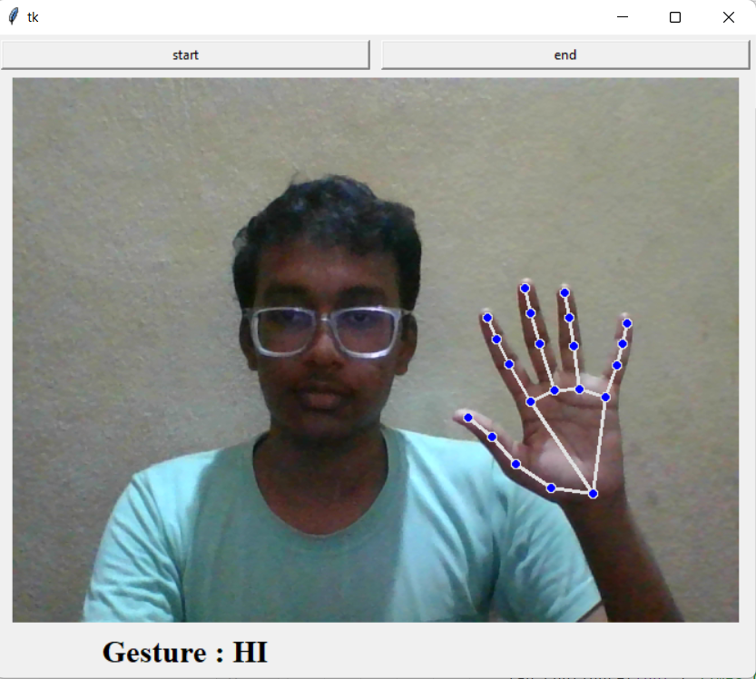

**<H1>HAND GESTURE RECOGNITION</H1>**
***
**<H2>Libraries Used:**</H2>
***
1. Opencv
2. Mediapipe
3. Tkinter
4. PIL
5. imutils

**<H2>Instrctions:**</H2>
***
1. Click on start and end button to start and end the gesture recognition.

2. Place your hand anywhere in the screen.
3. Recognized gesture name will be displayed on the screen.

**GESTURES:**
1. 

2. 

3.

